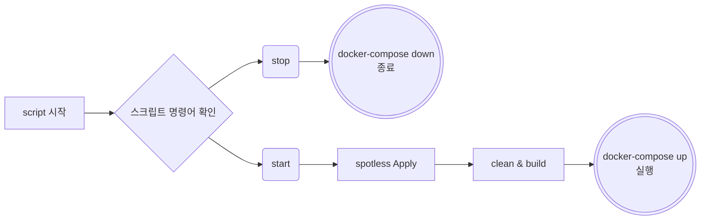
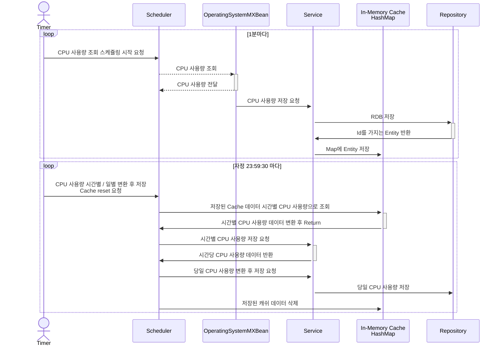

## 목차
1. [프로젝트 실행 방법](#프로젝트-실행-방법)
2. [의존성](#추가한-의존성-gradle)
3. [ERD](#erd)
4. [API명세서](#api-명세서)
5. [요구사항 해결 방법](#요구-사항의-해결-방법)


## 프로젝트 실행 방법
### Docker Compose를 활용한 Docker 실행
**Docker Compose 활용한 이유**
1. Docker를 통해 언제 어떤 환경에서도 실행 보장 받을 수 있다.
2. 삭제 등의 과정이 간단하다.
3. 실행 과정이 간단한다.

### 실행 방법
1. GitHub에서 clone
```shell
git clone https://github.com/SigLee2247/do-task.git
```

2. 해당 디렉토리 이동
```shell
cd do-task
```

3. 스크립트 실행
```shell
./script.sh start
```

스크립트 실행 시 다음과 같은 로직 진행

- spotlessApply 진행 하는 이유 : spotlessCheck 시 발생 하는 build 미연에 방지


## 추가한 의존성 Gradle
```groovy
    /*Spring*/
    implementation 'org.springframework.boot:spring-boot-starter-web'
    implementation 'org.springframework.boot:spring-boot-starter-validation'
    implementation 'org.springframework.boot:spring-boot-starter-data-jpa'


    /*Database*/
    runtimeOnly 'com.h2database:h2'
    runtimeOnly 'org.mariadb.jdbc:mariadb-java-client'

    /*Test*/
    testImplementation 'org.springframework.boot:spring-boot-starter-test'
    testRuntimeOnly 'org.junit.platform:junit-platform-launcher'
    testImplementation 'io.rest-assured:rest-assured:5.4.0'


    /*Lombok*/
    compileOnly 'org.projectlombok:lombok'
    annotationProcessor 'org.projectlombok:lombok'

    /*Swagger*/
    implementation 'org.springdoc:springdoc-openapi-starter-webmvc-ui:2.4.0'
```
- 서비스 구현 필수 의존성 (요구사항): mariadb, h2, swagger

**QueryDSL사용하지 않은 이유**
- QueryDSL 사용의 장점은 동적 쿼리를 처리할 때인데 QueryDSL을 사용할만큼의 Query가 구현에 없음

**RestAssured사용한 이유**
- 통합 테스트를 진행하기 위해 사용
- MockMVC를 활용할 수 도 있지만 조금 더 클라이언트 입장에서의 테스트를 쉽게 하고 싶어 사용


## ERD


[ERD 구현 사이트](https://dbdiagram.io/d/Terra-6472e2a37764f72fcff772ef)

**연관관계를 사용하지 않은 이유**
- 각각의 데이터를 조회할 수 있는 기간이 지정되어 있다.
- 조회가 가능한 기간이 아닌 데이터는 조회할 수 없다. -> 사용할 수 있는 곳 이 없다.
- 연관관계를 맺을 경우 분 단위 CPU 사용량 삭제 시 다른 테이블에 영향을 줄 수 있다.
  

## API 명세서
<details>
  <summary>조회 FLOWCHART</summary>

```mermaid
**FLOWCHART**
```mermaid
flowchart TB
A[Request 요청]
B[LocalDateTime으로 변환]
C{Validation 체크}
D[Validation 검증 실패 예외 응답 전달]
E[Controller Layer 진입]
F[Service Layer findUsage 메서드 진입]
G[ENUM을 활용해 조회하려는 데이터 타입 체크]
H[데이터 조회]
I[응답 데이터 전달]

A-->B
B-->C
C-->|검증 실패|D
C-->|검증 성공|E
E-->F
F-->G
G-->|조회를 위한 메서드 전달|H
H-->I
```
</details>
<br>
<details>
  <summary>분당 CPU 사용량 조회 API <b><code>[GET] /api/cpu-usage/minute</code></b></summary><br/>

- `startDate`, `endDate` 를 활용해 특정 구간의 분별 CPU 사용량 조회
- 각 **파라미터는 1주일을 넘길 수 없다**.

  <br/>

**Request**

| 전달 방식 | Name | Type | Description |Required|
|---  | --- | --- | ------------- | ----- |
| Parameter | startDate | `yyyy-MM-dd HH:mm:ss` | 조회 시작 시간 |TRUE|
| Parameter | endDate | `yyyy-MM-dd HH:mm:ss` | 조회 끝 시간 |TRUE|

      Parameter
        startDate=2024-05-23 12:00:00    | 1주일을 넘길 수 없다. 
        endDate=2024-05-24 12:00:00      | 1주일을 넘길 수 없다.

  <br/>

**Response**

| StatusCode | Message         | Description    |
  |------------|-----------------|----------------|
| 200        |                 | 조회 성공          |
| 400        | 검증 실패 파라미터 전달   | Validation  실패 |

```json
ResponseBody
{
    "timeStamp": "2024-05-25 21:40:24",
    "data": {
        "cpuUsageList": [
            {
                "usage": 58,
                "samplingDate": "2024-05-25 21:40:04"
            },
            {
                "usage": 71,
                "samplingDate": "2024-05-25 21:39:04"
            }
        ]
    }
}

```

</details>

<details>
  <summary>시간당 CPU 사용량 조회 API <b><code>[GET] /api/cpu-usage/hour</code></b></summary><br/>

- `startDate`, `endDate` 를 활용해 특정 구간의 시간별 CPU 사용량 조회
- 각 **파라미터는 3달을 넘길 수 없다**.

  <br/>

**Request**

| 전달 방식 | Name | Type | Description |Required|
|---  | --- | --- | ------------- | ----- |
| Parameter | startDate | `yyyy-MM-dd HH:mm:ss` | 조회 시작 시간 |TRUE|
| Parameter | endDate | `yyyy-MM-dd HH:mm:ss` | 조회 끝 시간 |TRUE|

      Parameter
        startDate=2024-05-23 12:00:00    | 3달을 넘길 수 없다. 
        endDate=2024-05-24 12:00:00      | 3달을 넘길 수 없다.

  <br/>

**Response**

| StatusCode | Message         | Description    |
  |------------|-----------------|----------------|
| 200        |                 | 조회 성공          |
| 400        | 검증 실패 파라미터 전달   | Validation  실패 |

```json
ResponseBody
{
  "timeStamp": "2024-05-25 21:42:03",
  "data": {
    "cpuUsageList": [
      {
        "maxUsage": 20,
        "minUsage": 7,
        "aveUsage": "24.5",
        "samplingDate": "2024-05-25 20:40:04"
      },
      {
        "maxUsage": 61,
        "minUsage": 5,
        "aveUsage": "24.5",
        "samplingDate": "2024-05-25 19:40:04"
      }
    ]
  }
}

```

</details>

<details>
  <summary>일당 CPU 사용량 조회 API <b><code>[GET] /api/cpu-usage/day</code></b></summary><br/>

- `startDate`, `endDate` 를 활용해 특정 구간의 분별 CPU 사용량 조회
- 각 **파라미터는 1년을 넘길 수 없다**.

  <br/>

**Request**

| 전달 방식 | Name | Type         | Description |Required|
|---  | --- |--------------| ------------- | ----- |
| Parameter | startDate | `yyyy-MM-dd` | 조회 시작 시간 |TRUE|
| Parameter | endDate | `yyyy-MM-dd` | 조회 끝 시간 |TRUE|

      Parameter
        startDate=2024-05-23    | 1년을 넘길 수 없다. 
        endDate=2024-05-24      | 1년을 넘길 수 없다.

  <br/>

**Response**

| StatusCode | Message         | Description    |
  |------------|-----------------|----------------|
| 200        |                 | 조회 성공          |
| 400        | 검증 실패 파라미터 전달   | Validation  실패 |

```json
ResponseBody
{
  "timeStamp": "2024-05-25 21:44:26",
  "data": {
    "cpuUsageList": [
      {
        "maxUsage": 55,
        "minUsage": 0,
        "aveUsage": "24.6",
        "samplingDate": "2024-05-24 00:00:00"
      },
      {
        "maxUsage": 61,
        "minUsage": 17,
        "aveUsage": "25.6",
        "samplingDate": "2024-05-23 00:00:00"
      }
    ]
  }
}
```

</details>

## Swagger 작동

서버 기동 후 127.0.0.1:8080/swagger 접속


## 요구 사항의 해결 방법

### CPU 사용량 저장 SequenceDiagram
Mapper의 변환을 제외한 저장 로직

- Stream을 활용해 가독성을 높이기 위해 노력함


### CPU 사용량 조회 및 저장 방법 - Scheduler 활용

### In-Memory 활용해 임시 저장한 이유  -Cache
1. 하루에 수집되는 데이터는 총 1440개 (1 * 60(분) * 24(시))
- 1시간, 하루에 한번씩 수집한 데이터 RDB에서 조회
hour, day 데이터 가공 후 파라미터 저장 비효율적이라고 판단
- 한번에 저장하려는 데이터의 크기가 1MB 이내
  - In memory에 저장될 int형 변수 총 3개라고 가정(실제 LocalDate, int 각1)
  -> 1440 * 3 * 4byte = 약 16.875KB 

**장애 발생 시 대응**
1. 서버 기동 시 오늘의 분당 CPU 사용량 데이터 RDB에서 가져와 In-Memory에 작제
2. 서버에 장애가 발생해 In-Memory에 있는 데이터가 사라져도 시작 시 복구 가능

**Redis 사용하지 않는이유**
- Redis 사용 시 서비스 장애가 발생해도 데이터를 보존할 수 있으나,
본 서비스의 목적은 해당 서버의 CPU를 조사하는 것 -> 과한 사용이라고 판단

---

### Service 에서 조건별 조회 기능 switch 사용한 이유


1. 서로 유사한 역할을 수행, 반환 데이터도 유사함
2. 반환 데이터 타입 추상화를 통해 메서드 재활용이 가능하다고 판단

**RSP 준수한다고 생각했던 이유**

- `findUsage()` 메서드는 검색의 책임만을 가지고 있다고 판단
- 실제 데이터를 가져오는 것은 각각의 메서드들에서 진행(조회의 책임을 해당 메서드에 위임)
- 팩토리 패턴을 구현하기 위해 작업

### Mapper class를 따로 둔 이유
- Service 클래스에서 클래스 변경과 서비스 로직을 진행하는 것은 과한 역할이라고 판단

---
### Validation 설정


- 입력 받을 값의 파라미터는 `LocalDateTime` `LocalDate` 2가지의 종류로 구성됨
- 커스텀 어노테이션을 활용한 Validation 진행
- Controller 에서 입력 받을 값을 두 클래스가 구현하고 있는 `Temporal` 인터페이스를 활용해 Validation 진행 (추상화를 통한 코드 재활용)

### 예외 처리
- `Controller`에서 요청 오류로 발생할 수 있는 `Exception` `ControllerAdvice` 에 추가해 예외 처리
- 서비스 장에로 발생할 수 있는 `Exception`은 `BusinessException`을 활용

### Controller Interface  / 구현체 분리 이유
- 스웨거의 문서 자동화를 위해 사용하는 어노테이션들을 Controller 인터페이스로 옮겨 
구현체에서는 Controller의 구현체에서는 구현 로직만을 확인할 수 있도록 하기 위해 분리

### LocalDateTime, LocalDate Request 매핑 변경 전략
`application.yml`을 활용해 format 지정

**converter를 사용하지 않는 이유**
- `String` -> `LocalDateTime` 으로 변경하게 될 경우 일반적인 String 값이 들어오게 되면 장애 발생

### Spotless를 활용한 코드 통일
- spotless + google lint를 활용해 코드 통일성 부여
